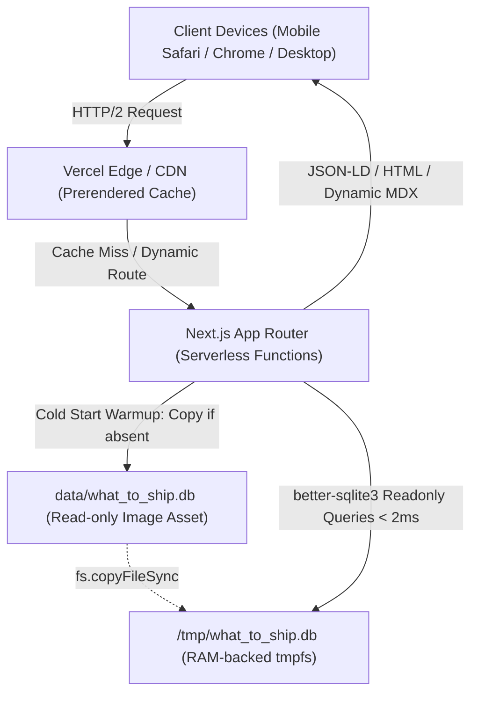

# Architecture — what-to-ship

Updated: 2026-09-13
Expected stack: Next.js 16 (App Router, TypeScript, Tailwind CSS v4)

## Selected capabilities

| Capability | Decision | Proven operational |
|---|---|---|
| Database | SQLite via `better-sqlite3` + `drizzle-orm` (FTS5 search) | Yes |
| Ephemeral Storage | AWS Lambda `/tmp` mirror for serverless execution | Yes |
| Authentication | `none` (Public Intelligence Engine) | Yes |
| Client State | `useSyncExternalStore` + `localStorage` (Zero external state libs) | Yes |
| SEO & Social | Dynamic Sitemap Index + Dynamic `@vercel/og` PNG Generator | Yes |
| Deployment target | Vercel Serverless (`https://whattoship.vercel.app`) | Yes |

## Current System Overview

WhatToShip is an autonomous software idea intelligence engine indexing 13,445 validated opportunities. The system is architected as an ultra-fast, zero-cloud-database platform that bundles a pre-seeded, high-performance SQLite database directly with the serverless application runtime.

## System Layers & Boundaries

### 1. Data Access & Storage Layer
- **Source Database (`data/what_to_ship.db`)**: Pre-compiled SQLite database with WAL configuration, housing tables `ideas`, `idea_analyses`, and `collections`.
- **FTS5 Virtual Table (`ideas_fts`)**: Full-Text Search index delivering tokenized keyword search across 13,445 software ideas in ~1.07ms.
- **Serverless `/tmp` Resolver (`src/db/index.ts`)**:
  - AWS Lambda / Vercel serverless environments mount the root application code as read-only (`EROFS`).
  - To prevent SQLite POSIX lock or journal errors (`SQLITE_CANTOPEN`), `resolveDatabasePath()` checks `/tmp/what_to_ship.db`.
  - On cold start, the ~15MB database is copied to `/tmp` via `fs.copyFileSync`.
  - The connection is opened with `{ readonly: true }` and `PRAGMA query_only = ON` with a 32MB cache, ensuring zero lock contention and instantaneous sub-2ms query performance.

### 2. Application & API Routing Layer (`src/app/`)
- **Discovery Catalog (`/api/ideas`)**: Supports multi-dimensional filtering (`category`, `type`, `difficulty`, `revenue_potential`, `technical_complexity`, `trending_pct`) and FTS5 search queries with paginated responses.
- **Dossier Deep Dive (`/api/ideas/[slug]`)**: Returns complete 10-pillar intelligence payload (metrics, recommended stack, API contracts, unit economics, MVP checklist, competitor wedges, target countries, buyer personas, and demographics).
- **On-Demand MDX Exporter (`/api/ideas/[slug]/mdx`)**: Generates production-grade, frontmatter-rich `.mdx` files dynamically on request for markdown consumers or AI coding agents.
- **CSV & JSON Exporter (`/api/export`)**: Streaming export endpoint for custom filtered cohorts.
- **Programmatic SEO & Social**:
  - Dynamic Sitemap index (`/sitemap.xml`) routing into chunked sub-sitemaps (`/sitemap-[id].xml` with 2,000 URLs each).
  - OpenGraph image generator (`/ideas/[slug]/opengraph-image`) rendering 1200x630 branded social share cards on the edge.

### 3. User Experience & Design System
- **Google Gemini Light Aesthetic**: Clean white (`#ffffff`) and soft gray (`#f8f9fa`) canvas with refined neutral borders (`#e8eaed`) and high-legibility dark typography (`#1f1f1f`).
- **Mobile Web App Ergonomics**:
  - Docked bottom navigation bar (`BottomNav.tsx`) with safe-area inset support (`env(safe-area-inset-bottom)`).
  - Touch targets calibrated to $\ge 44\text{px}$ for touch ergonomics.
  - Form inputs (`SearchCapsule.tsx`, `FilterBar.tsx`) enforce 16px minimum font size to prevent iOS Safari auto-zoom behavior.
- **Reactive State Management**:
  - Bookmark Save/Unsave system implemented using native `useSyncExternalStore` and `localStorage`, ensuring cross-component synchronization between catalog cards, detail views, and bottom navigation badges with zero external runtime dependencies.

## Verification Scenarios

1. **Serverless Database Warmup**:
   - `curl -s "https://whattoship.vercel.app/api/ideas?limit=1"` returns HTTP 200 with total count `13445`.
2. **FTS5 Keyword Query Performance**:
   - Search queries via `/api/ideas?q=calculator` execute in $< 5\text{ms}$.
3. **On-Demand MDX Route**:
   - `curl -s "https://whattoship.vercel.app/api/ideas/translate-to-english/mdx"` returns valid Markdown frontmatter with `targetCountries` and `demographics`.
4. **Code Quality**:
   - `npm run lint` passes with 0 errors and 0 warnings.
   - `npm run build` compiles 111 pre-rendered static routes and dynamic endpoints cleanly.
