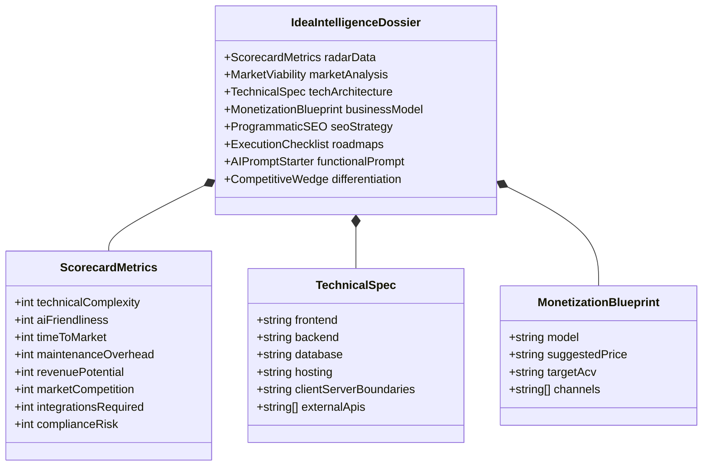

# PLAN: WhatToShip Technical Architecture & Data Specification

## 1. System Architecture

WhatToShip is architected as an edge-ready, hybrid-rendered Next.js 15 application prioritizing sub-second initial load, zero server management overhead, and high programmatic SEO capability:

```
[ Client Browser / Search Bot ]
              │
              ▼
[ Next.js 15 App Router Edge / Server Layer ]
   ├── Server Components (Catalog Grid, SEO Metadata, Static Shell)
   ├── Client Components (Search Filters, Interactive Radar, Copy Prompt, Bookmarks)
   └── Route Handlers / API (/api/ideas, /api/sitemap-[id].xml, /api/export)
              │
              ▼
[ Data Access Layer (Drizzle ORM + SQLite / Turso) ]
   ├── ideas (13,445 records with FTS5 virtual search index)
   ├── idea_analyses (deep structured JSON dossiers)
   └── collections & collection_items (thematic groupings)
              ▲
              │
[ Offline / Batch Enrichment Engine ]
   └── scripts/enrich-ideas.ts (LLM-powered analytical generator with idempotent caching)
```

### Rendering & Caching Strategy
- **Homepage & Catalog (`/`)**: Server Component with dynamic URL search param parsing and streaming fallback.
- **Idea Detail Dossier (`/ideas/[slug]`)**: Incremental Static Regeneration (ISR). Top 500 high-priority ideas pre-rendered at build time (`generateStaticParams`); remaining 12,945 ideas rendered on-first-request and cached at the edge with `revalidate = 86400` (24 hours).
- **Curated Collections (`/collections/[slug]`)**: Static Generation with ISR.
- **Sitemaps (`/sitemap-[id].xml`)**: Dynamic Route Handlers streaming XML chunk responses of 2,000 URLs each.

---

## 2. Data Schema (Drizzle ORM)

```typescript
// schema.ts
import { sqliteTable, text, integer, real, index } from 'drizzle-orm/sqlite-core';

export const ideas = sqliteTable('ideas', {
  id: integer('id').primaryKey({ autoIncrement: true }),
  slug: text('slug').notNull().unique(),
  keyword: text('keyword').notNull(),
  type: text('type', { enum: ['Online Tool', 'SaaS'] }).notNull(),
  volume: integer('volume').notNull().default(0),
  difficulty: text('difficulty').notNull(),
  difficultyRank: integer('difficulty_rank').notNull().default(3), // 1: Extremely Easy .. 5: Extremely Hard
  trendingPct: real('trending_pct').notNull().default(0.0),
  technicalComplexity: integer('technical_complexity').notNull().default(1), // 1-5
  aiFriendliness: integer('ai_friendliness').notNull().default(1), // 1-5
  timeToMarket: integer('time_to_market').notNull().default(1), // 1-5
  maintenanceOverhead: integer('maintenance_overhead').notNull().default(1), // 1-5
  revenuePotential: integer('revenue_potential').notNull().default(1), // 1-5
  marketCompetition: integer('market_competition').notNull().default(1), // 1-5
  integrationsRequired: integer('integrations_required').notNull().default(1), // 1-5
  complianceRisk: integer('compliance_risk').notNull().default(1), // 1-5
  category: text('category').notNull().default('General / Other'),
  createdAt: integer('created_at', { mode: 'timestamp' }).$defaultFn(() => new Date()),
  updatedAt: integer('updated_at', { mode: 'timestamp' }).$defaultFn(() => new Date()),
}, (table) => ({
  slugIdx: index('idx_ideas_slug').on(table.slug),
  typeIdx: index('idx_ideas_type').on(table.type),
  volumeIdx: index('idx_ideas_volume').on(table.volume),
  diffRankIdx: index('idx_ideas_diff_rank').on(table.difficultyRank),
  trendIdx: index('idx_ideas_trend').on(table.trendingPct),
  catIdx: index('idx_ideas_category').on(table.category),
  revIdx: index('idx_ideas_revenue').on(table.revenuePotential),
  techIdx: index('idx_ideas_tech').on(table.technicalComplexity),
}));

export const ideaAnalyses = sqliteTable('idea_analyses', {
  id: integer('id').primaryKey({ autoIncrement: true }),
  ideaId: integer('idea_id').notNull().references(() => ideas.id, { onDelete: 'cascade' }),
  slug: text('slug').notNull().unique(),
  
  // Executive Summary & Audience
  executiveSummary: text('executive_summary').notNull(),
  targetAudience: text('target_audience').notNull(),
  searchIntent: text('search_intent').notNull(), // informational | transactional | commercial
  
  // Technical Architecture Specification
  recommendedStack: text('recommended_stack').notNull(), // JSON string: { frontend, backend, database, hosting }
  clientVsServerBoundary: text('client_vs_server_boundary').notNull(),
  apiDependencies: text('api_dependencies').notNull(), // JSON array
  architectureOverview: text('architecture_overview').notNull(),
  
  // Business & Monetization Blueprint
  monetizationModel: text('monetization_model').notNull(),
  pricingRecommendation: text('pricing_recommendation').notNull(),
  estimatedAcv: text('estimated_acv').notNull(),
  monetizationChannels: text('monetization_channels').notNull(), // JSON array: ads, affiliate, sub, freemium
  
  // SEO & Growth Playbook
  seedKeywords: text('seed_keywords').notNull(), // JSON array
  secondaryKeywords: text('secondary_keywords').notNull(), // JSON array
  linkBuildingAngle: text('link_building_angle').notNull(),
  schemaType: text('schema_type').notNull().default('SoftwareApplication'),
  
  // Execution Roadmap & Milestones
  mvpIn48Hours: text('mvp_in_48_hours').notNull(), // Markdown checklist
  fullProductRoadmap: text('full_product_roadmap').notNull(), // Markdown checklist
  
  // Ready-to-use AI Prompt Template
  aiPromptTemplate: text('ai_prompt_template').notNull(),
  
  // Competitor & Differentiation Wedge
  competitorWeaknesses: text('competitor_weaknesses').notNull(),
  unfairAdvantageWedge: text('unfair_advantage_wedge').notNull(),
  
  // Metadata
  version: integer('version').notNull().default(1),
  updatedAt: integer('updated_at', { mode: 'timestamp' }).$defaultFn(() => new Date()),
}, (table) => ({
  ideaIdIdx: index('idx_analysis_idea_id').on(table.ideaId),
  slugIdx: index('idx_analysis_slug').on(table.slug),
}));

export const collections = sqliteTable('collections', {
  id: integer('id').primaryKey({ autoIncrement: true }),
  slug: text('slug').notNull().unique(),
  title: text('title').notNull(),
  tagline: text('tagline').notNull(),
  description: text('description').notNull(),
  iconName: text('icon_name').notNull().default('Sparkles'),
  filterCriteria: text('filter_criteria').notNull(), // JSON string representing query filter
  itemCount: integer('item_count').notNull().default(0),
  sortOrder: integer('sort_order').notNull().default(0),
});
```

---

## 3. Deep Analysis Breakdown Structure

Each idea in `idea_analyses` contains a deterministic analytical engine + LLM-augmented deep breakdown formatted into clean sections:



---

## 4. API Endpoints & Contracts

### `GET /api/ideas`
- **Query Parameters**:
  - `q`: Search keyword (string, debounced)
  - `type`: `SaaS` | `Online Tool` | `all`
  - `category`: string (e.g. `Calculator`, `Generator`, `FinTech & B2B Ops SaaS`)
  - `min_vol`: integer
  - `max_vol`: integer
  - `difficulty`: `Extremely Easy` | `Easy` | `Moderate` | `Hard` | `Extremely Hard`
  - `max_tech`: integer (1-5)
  - `min_rev`: integer (1-5)
  - `min_ai`: integer (1-5)
  - `trending`: float (minimum % growth)
  - `sort`: `volume` | `trending` | `revenue` | `tech` | `difficulty` (default: `volume`)
  - `page`: integer (default: 1)
  - `limit`: integer (default: 30, max: 100)
- **Response**:
  ```json
  {
    "data": [
      {
        "id": 1,
        "slug": "english-to-nepali-converter",
        "keyword": "english to nepali converter",
        "type": "Online Tool",
        "volume": 500225,
        "difficulty": "Easy",
        "difficultyRank": 2,
        "trendingPct": 7.0,
        "technicalComplexity": 2,
        "aiFriendliness": 2,
        "timeToMarket": 2,
        "revenuePotential": 2,
        "category": "Converter"
      }
    ],
    "pagination": {
      "page": 1,
      "limit": 30,
      "total": 13445,
      "totalPages": 449
    }
  }
  ```

### `GET /api/ideas/[slug]`
- Returns the complete idea metadata and the full analytical dossier from `idea_analyses`.

### `GET /api/export`
- Accepts the same filter query parameters as `GET /api/ideas`.
- Returns a downloadable `.csv` or `.json` stream.

---

## 5. Programmatic SEO & Sitemap Strategy
- Total URLs to index: **13,445 idea pages** + 10 category hubs + 6 collection hubs.
- **Sitemap Architecture**:
  - `/sitemap.xml`: Sitemap index referencing sub-sitemaps.
  - `/sitemap-1.xml` to `/sitemap-7.xml`: 2,000 URLs each, generated deterministically from `ideas.id` range.
- **Metadata & OpenGraph**:
  - Auto-generated Next.js `generateMetadata()` on `/ideas/[slug]`.
  - Next.js `ImageResponse` on `/ideas/[slug]/opengraph-image.tsx` generating custom branding, search volume pill, difficulty badge, and keyword title on the fly.
  - JSON-LD Structured Data:
    ```json
    {
      "@context": "https://schema.org",
      "@type": "SoftwareApplication",
      "name": "English to Nepali Converter",
      "applicationCategory": "UtilitiesApplication",
      "operatingSystem": "Web",
      "offers": {
        "@type": "Offer",
        "price": "0",
        "priceCurrency": "USD"
      }
    }
    ```

---

## 6. Risks & Mitigations
| Risk | Probability | Impact | Mitigation Strategy |
|---|:---:|:---:|---|
| Edge runtime file lock on SQLite | Low | High | Use Turso (libSQL over HTTP) for distributed serverless or read-only bundled SQLite instance. |
| Crawling budget exhaustion by bots | Medium | Medium | Implement clean canonical tags, prioritize high-volume (>1k/mo) URLs in sitemaps, and use standard HTTP 304 caching. |
| Massive batch generation cost for LLM | Medium | Low | Hybrid model: generate rich deterministic baseline analysis from the 13 metrics for all 13,445 items; selectively use deep LLM synthesis on top 1,000 high-demand ideas. |
| Slug collisions on keywords | Low | Low | Automated slugifier with numeric disambiguation suffix (`url-safe-slug-1`). |
