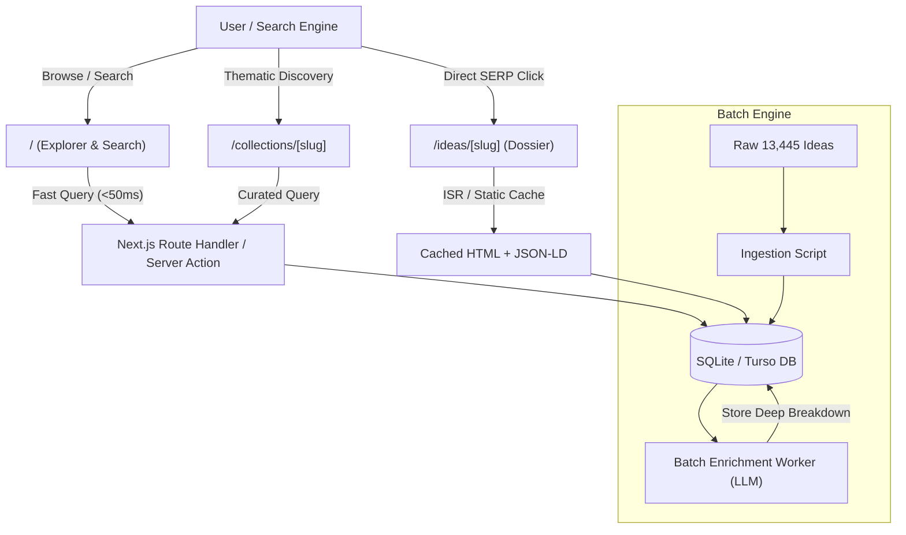

# PRD: WhatToShip — Live Digital Product Idea & Execution Intelligence Platform

## Overview
WhatToShip is a high-performance web platform and programmatic intelligence engine that transforms a dataset of 13,445 software and tool opportunities (representing 234.7M monthly search queries) into an actionable, searchable, and monetizable discovery product. Built for solo-developers, indie hackers, agency builders, and system architects, WhatToShip provides not only raw search metrics, but also an **in-depth analytical breakdown for every single idea**—covering market viability, recommended tech stack, monetization blueprint, programmatic SEO angles, rapid MVP execution checklists, and ready-to-run AI coding prompts.

## Product, Audience, and Market Context
- **Primary Users**: Solo-founders, full-stack builders, SEO professionals, digital product architects looking for high-conviction software and utility tools to build and monetize.
- **Problem**: Raw keyword lists and SEO spreadsheets are overwhelming, sterile, and lack engineering context. Builders spend weeks researching whether an idea is viable, what stack to use, how to monetize it, and what risks exist.
- **Solution**: A fast, programmatic web directory where all 13,445 ideas are indexed, searchable in real-time, and accompanied by a comprehensive **Deep-Dive Intelligence Dossier** detailing exactly *how* to build, rank, and monetize each product.
- **Audience Scope**: Global (primary search volume in US/Global English markets). Responsive on mobile and desktop.
- **Evidence & Data Source**: Backed by verified empirical dataset (`what_to_ship.db` / `what_to_ship.csv`) containing 13,445 ideas, 13 quantitative dimensions, and over 234.7 million monthly search queries.

## Goals
- **G-1**: Deliver sub-100ms real-time search, filtering, and sorting across all 13,445 ideas by Type, Volume, Difficulty, Trending %, Tech Complexity, AI-Friendliness, and Revenue Potential.
- **G-2**: Provide a dedicated, SEO-optimized intelligence dossier page (`/ideas/[slug]`) for every idea with a structured, multi-section analytical breakdown.
- **G-3**: Achieve 100% programmatic SEO indexation coverage with automated XML sitemaps, structured JSON-LD data (`SoftwareApplication` / `Dataset`), and dynamic OpenGraph image previews.
- **G-4**: Curate high-impact thematic collections (e.g. "Instant Wins / Fast TTM", "High-Margin Micro-SaaS", "Viral Breakouts >100%", "Financial Calculators") to streamline discovery.
- **G-5**: Enable flexible export (CSV/JSON) and bookmarking for registered or active users.

## Non-Goals
- Not building an automated code generator that writes and deploys the entire SaaS automatically in one click (the platform provides blueprints, starter prompts, and architectures, not a runtime code-hosting platform).
- Not building a real-time live Google Search scraper (all metrics stem from the curated 13,445 dataset, updated via scheduled batch ingestion).
- Not offering generic blogging or unvetted user-submitted forum spam.

## Requirements (EARS-Style)

### Core Directory & Search
- **REQ-1 (Ubiquitous)**: The system shall catalog and index 13,445 software and online tool ideas with attributes: `keyword`, `slug`, `type`, `volume`, `difficulty`, `difficulty_rank`, `trending_pct`, `technical_complexity`, `ai_friendliness`, `time_to_market`, `maintenance_overhead`, `revenue_potential`, `market_competition`, `integrations_required`, `compliance_risk`, and `category`.
- **REQ-2 (State-driven)**: While a user applies filters (category, type, volume range, difficulty, tech complexity, revenue potential, or trending threshold) or types into the search bar, the system shall return filtered results in under 100 milliseconds and synchronize filter states to URL search parameters.
- **REQ-3 (State-driven)**: While displaying the idea explorer, the system shall support responsive paginated or infinite-scroll grid and list views with multi-column sorting (by Volume, Trend %, Revenue, Tech Complexity, or Difficulty).

### Individual Idea Intelligence Dossier
- **REQ-4 (Event-driven)**: When a user accesses an idea page at `/ideas/[slug]`, the system shall render a comprehensive **Idea Intelligence Dossier** featuring:
  1. **Executive Scorecard**: Visual radar/gauge metrics for the 8 quantitative dimensions (Tech Complexity, AI Fit, Time-to-Market, Maintenance, Revenue, Competition, Integrations, Risk).
  2. **Market Viability & Search Analysis**: Monthly search volume, search intent classification (informational, transactional, commercial), seasonality profile, and trend growth trajectory.
  3. **Technical Architecture & Build Plan**: Recommended frontend/backend stack, client-side vs server-side boundaries, database requirements, external APIs, and architectural risk notes.
  4. **Monetization Blueprint**: Recommended business model (Freemium, Display Ads, Affiliate, Subscription, Pay-per-credit), suggested pricing tiers, and target ACV.
  5. **Programmatic SEO Playbook**: Seed keywords, secondary keyword variations, search intent mapping, and JSON-LD schema recommendations.
  6. **Rapid MVP Roadmap**: Actionable phased checklist (48-hour MVP vs 1-week beta vs 1-month full product).
  7. **AI Prompt Template & Starter Spec**: A copyable, structured prompt engineered for Claude/Gemini/Codex to build the foundational MVP code.
  8. **Competitor & Differentiation Wedge**: Weaknesses of incumbent tools on Google SERP and unfair advantage opportunities.
- **REQ-5 (Ubiquitous)**: The system shall serve idea intelligence dossiers from pre-computed database records and edge cache to guarantee page load times under 200 milliseconds without on-the-fly LLM latency.

### Curated Collections & Discovery
- **REQ-6 (Event-driven)**: When a user visits `/collections`, the system shall display curated strategic collections:
  - *Instant Wins (Low Tech, Fast TTM, Easy SEO)*
  - *High-Yield Micro-SaaS (High Revenue, Low Churn)*
  - *Breakout Viral Trends (>100% Growth)*
  - *AI-Native Wrappers (AI Fit >= 4)*
  - *High-RPM Financial Utilities*
- **REQ-7 (Event-driven)**: When viewing a specific idea dossier, the system shall suggest 4 to 6 contextually related ideas within the same category or intent cluster.

### SEO & Programmatic Indexing
- **REQ-8 (Ubiquitous)**: The system shall generate paginated XML sitemap indexes (chunked into 2,000 URLs per file) covering all 13,445 ideas and category hubs.
- **REQ-9 (Ubiquitous)**: The system shall output semantic JSON-LD structured data (`SoftwareApplication`, `WebApplication`, or `Dataset`) and dynamic OpenGraph social preview images (`og:image`) for every idea route.

### Data Management & Enrichment Engine
- **REQ-10 (Event-driven)**: When an administrator executes the CLI ingestion/enrichment pipeline (`npm run enrich:batch`), the system shall process ideas in batches, generate structured JSON analytical dossiers using LLM schemas, validate schema compliance, and update the local database idempotently.
- **REQ-11 (Unwanted)**: If a user navigates to an invalid slug, then the system shall return a custom 404 page displaying top trending alternatives.
- **REQ-12 (Optional)**: Where authenticated or approved, the system shall allow users to bookmark ideas and export filtered results to CSV or JSON format.
- **REQ-13 (Ubiquitous)**: The system shall adhere to the Google Gemini design specification in [DESIGN.md](file:///Users/ongki/Documents/work/prd/what-to-ship/DESIGN.md), featuring the floating prompt capsule search, ambient dark theme (`#131314`), Gemini sparkle aura gradient accents, and responsive two-panel intelligence canvas.

## Stack & Constraints
- **Framework**: Next.js 15 (App Router) + React 19 + TypeScript.
- **Visual Design & UX Archetype**: Google Gemini AI Workspace reference (see [DESIGN.md](file:///Users/ongki/Documents/work/prd/what-to-ship/DESIGN.md)): ambient dark theme `#131314`, floating prompt capsule search, signature Gemini aura gradients (`#4285f4` / `#9b72cb` / `#d96570`), high-radius surfaces (`rounded-2xl` / `rounded-full`), and structured intelligence canvas.
- **Styling & UI**: Tailwind CSS + Lucide React + Radix UI / Shadcn primitives.
- **Database & ORM**: SQLite / Turso / PostgreSQL with Drizzle ORM.
- **Full-Text Search**: SQLite FTS5 / PostgreSQL tsvector with client-side reactive query sync.
- **Deployment Target**: Vercel / Cloudflare Pages / Node.js VPS.
- **Performance Budget**: LCP < 1.2s, CLS = 0, FID/INP < 50ms. Sub-100ms API search responses.

## Technical Decisions (ADR-Lite)
- **Decision 1: Pre-computed Analytical Dossiers instead of Live On-Demand LLM Generation**
  - *Why*: Generating deep analyses on-demand for 13,445 pages would incur unacceptable latency (5-15s per page load) and massive API costs.
  - *Consequence*: Fast sub-200ms page loads, zero runtime API bill, and static/ISR cacheability. An offline batch enrichment CLI script populates the `idea_analyses` table.
- **Decision 2: SQLite / Turso with Drizzle ORM for Data Layer**
  - *Why*: The dataset is 13,445 rows (~2.5 MB SQLite DB), which easily fits in memory, executes queries in < 2ms, and requires zero DevOps overhead. Turso provides global edge replicas if distributed deployment is desired.
  - *Consequence*: Single-file database portability with full SQL capabilities and zero database hosting fees.
- **Decision 3: Multi-Sitemap Chunks (Sitemap Index)**
  - *Why*: 13,445 URLs exceed optimal single-file sitemap size for search crawler reliability.
  - *Consequence*: Split into `sitemap-index.xml` referencing `sitemap-1.xml` through `sitemap-7.xml` (2,000 URLs each).

## Diagrams

### User Journey & Architecture Flow

## Milestones
- [ ] **v0.1 Data Ingestion & Database Engine**: Load 13,445 ideas into Drizzle schema with FTS5 search index and automated slug generation.
- [ ] **v0.2 Batch Enrichment Pipeline**: Implement deterministic + LLM-augmented enrichment script to generate structured analytical dossiers.
- [ ] **v0.3 Explorer UI & Fast Search**: Build responsive catalog UI with real-time faceted filtering, sorting, and pagination.
- [ ] **v0.4 Idea Intelligence Dossier (`/ideas/[slug]`)**: Implement rich detail page with radar scorecards, roadmap, architecture, and copyable AI prompts.
- [ ] **v0.5 Curated Collections & SEO Engine**: Deploy curated collection pages, dynamic OG images, and chunked XML sitemaps.
- [ ] **v0.6 Public Launch & Polish**: Comprehensive validation, performance audit (Lighthouse 95+), and production deployment.
